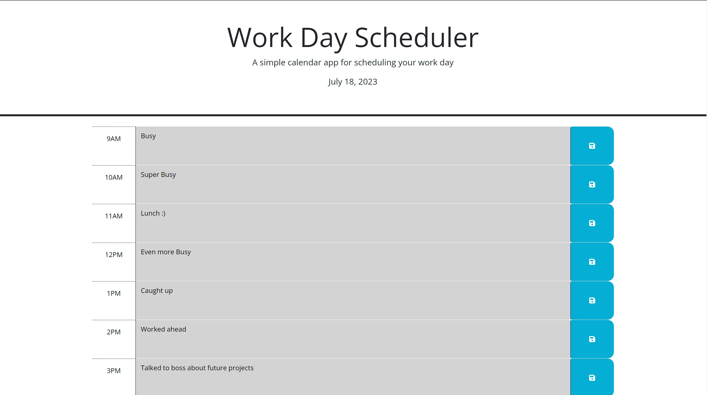

# Work-Day-Tracker

## Description
The Work Day Tracker App allows you to save events for each work day from 9:00 AM to 5:00 PM. This application is run in the browser and dynamically updates the HTML and CSS using jQuery.
## Preview
 
## Features
This app enables the user to view past, present, and future events. The application will dynamically update throughout the day. It indicates passed time by graying out the relevant section. The present moment is displayed in red to remind you to focus and complete current tasks. The future is presented in green, encouraging you to keep going. Users can update the application to display what has actually happened throughout the day. This is achieved by saving the input into local storage.

## Links 
[Repo](https://github.com/Fallen-Master/Work-Day-Tracker) [Website]
### Credit
Thanks to the staff at Bootcamp Spot for creating the HTML and CSS.
The JavaScript code was composed using jQuery by [Rafael Gomez](https://github.com/Fallen-Master).

### License
This project is licensed under the [MIT License](LICENSE).

